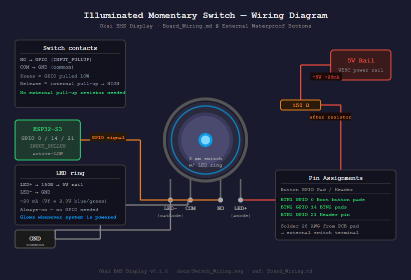

# Board Wiring — LILYGO T-Display-S3

## Official Pinout Reference


*Source: https://github.com/Xinyuan-LilyGO/T-Display-S3*

---

## Our Connections

```
┌─────────────────────────────────────────────────────────┐
│                   LILYGO T-Display-S3                   │
│                                                         │
│  [USB-C]  ← Debug / programming (UART0 GPIO43/44)       │
│                                                         │
│  GPIO  1  ── Pack 1 TX (BMS → ESP32)                    │
│  GPIO  2  ── Shared TX bus → ALL 4 pack RX pins         │
│  GPIO 16  ── Pack 2 TX (BMS → ESP32)                    │
│  GPIO 17  ── Pack 3 TX (BMS → ESP32)  [SoftSerial]      │
│  GPIO 18  ── Pack 4 TX (BMS → ESP32)  [SoftSerial]      │
│  GPIO 21  ── (spare)                                    │
│                                                         │
│  GPIO  0  ── Built-in Button 1 (WiFi toggle)            │
│  GPIO 14  ── Built-in Button 2 (spare)                  │
│  GPIO 38  ── Backlight (internal — do not wire)         │
│  GPIO 15  ── Power enable (internal — do not wire)      │
│                                                         │
│  5V / GND ── Powered from VESC UART rail                │
└─────────────────────────────────────────────────────────┘
```

---

## Shared TX Bus Wiring

GPIO 2 drives all four pack RX lines in parallel:

```
ESP32-S3
GPIO 2 (TX) ──┬── BMS Pack 1 RX
              ├── BMS Pack 2 RX
              ├── BMS Pack 3 RX
              └── BMS Pack 4 RX
```

Each BMS pack TX goes to its own dedicated ESP32 RX pin:

```
BMS Pack 1 TX ── GPIO  1  (UART1 RX)
BMS Pack 2 TX ── GPIO 16  (UART2 RX)
BMS Pack 3 TX ── GPIO 17  (SoftSerial RX)
BMS Pack 4 TX ── GPIO 18  (SoftSerial RX)
```

---

## External Waterproof Buttons

Three momentary pushbutton switches (illuminated 8 mm momentary push-buttons) mounted on the enclosure.

**Reference photo:** `docs/switch-led-momentary.avif`

**Wiring diagram:** `docs/Switch_Wiring.svg` / `docs/Switch_Wiring.png`



### Extending the onboard buttons

The T-Display-S3 has two onboard SMD buttons. Solder thin wires (28 AWG) directly to their pads and run to the external switches — the external switch is wired **in parallel** with the onboard one.

```
Button 1 (GPIO 0)  — solder to Boot button pads  → external switch terminals
Button 2 (GPIO 14) — solder to BTN2 button pads  → external switch terminals
Button 3 (GPIO 21) — solder to GPIO 21 header pin → external switch terminals
```

All three are active-LOW: press pulls GPIO to GND. Use `INPUT_PULLUP` in firmware — no external pull-up resistors needed.

### Switch LED wiring (always-on, no GPIO required)

Wire each switch LED independently to the 5V VESC rail:

```
5V rail ──[150Ω]── LED+ (switch anode)
                   LED− (switch cathode) ── GND
```

150Ω gives ~20mA at 5V for a green/blue LED (Vf ≈ 2.0V). Buttons glow whenever the system is powered. No firmware control needed — the display handles all status indication.

---

## Do Not Use — Reserved Pins

| GPIO Range | Reason |
|---|---|
| 5, 6, 7, 8, 9 | TFT display control (CS/DC/RST/WR/RD) |
| 39–42, 45–48 | TFT parallel data bus D0–D7 |
| 38 | TFT backlight enable |
| 43, 44 | UART0 TX/RX (USB-C) |
| 10–13 | PSRAM / Flash |
| 3, 45, 46 | Strapping pins |
| 0 | BOOT button — used for WiFi toggle |
| 4 | Battery voltage ADC |
| 15 | Power enable rail |

---

## BMS Connector (each pack)

Each Ruipu/Okai 10S4P pack exposes a UART port at 9600 baud, 3.3V logic:

| BMS Pin | Connect to |
|---|---|
| TX | ESP32 RX pin (dedicated per pack — see table above) |
| RX | GPIO 2 (shared TX bus) |
| GND | Common GND |

> **Note:** Do NOT connect BMS VCC to ESP32 3.3V. The ESP32 is powered from the VESC 5V rail. GND must be common across all packs and the ESP32.
