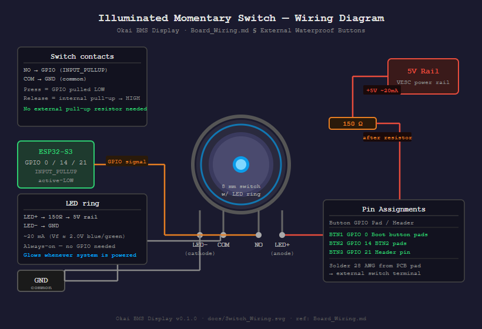

# Board Wiring — LILYGO T-Display-S3

## Official Pinout Reference


*Source: https://github.com/Xinyuan-LilyGO/T-Display-S3*

---

## Our Connections

```
┌─────────────────────────────────────────────────────────┐
│                   LILYGO T-Display-S3                   │
│                   MAC: a0:f2:62:e1:e9:ec                │
│                                                         │
│  [USB-C]  ← Debug / programming (UART0 GPIO43/44)       │
│                                                         │
│  GPIO  1  ── Pack 1 RX (BMS TX → ESP32)                 │
│  GPIO  2  ── Shared TX bus → ALL 4 pack RX pins         │
│  GPIO 10  ── NeoPixel status bar — strip 1 (data)       │
│  GPIO 11  ── RTC DS3231 SDA  (I2C)                       │
│  GPIO 12  ── RTC DS3231 SCL  (I2C)                       │
│  GPIO 13  ── NeoPixel status bar — strip 2 (data)  ◄──yellow wire (was Light FET)
│  GPIO 16  ── Pack 2 RX (BMS TX → ESP32)                 │
│  GPIO 17  ── Pack 3 RX (BMS TX → ESP32)  [SoftSerial]  │
│  GPIO 18  ── Pack 4 RX (BMS TX → ESP32)  [SoftSerial]  │
│                                                         │
│  GPIO  0  ── BTN1: short = WiFi toggle │ 4s hold = sleep│
│  GPIO 14  ── BTN2: next screen →                        │
│  GPIO 21  ── BTN3: prev screen ← │ long = label assign  │
│             BTN2+BTN3 = (was light toggle — retired)    │
│                                                         │
│  GPIO 38  ── Backlight (internal — do not wire)         │
│  GPIO 15  ── Power enable (internal — do not wire)      │
│                                                         │
│  5V / GND ── Powered from VESC UART rail                │
└─────────────────────────────────────────────────────────┘
```

---

## Shared TX Bus Wiring

GPIO 2 drives all four pack RX lines in parallel:

```
ESP32-S3
GPIO 2 (TX) ──┬── BMS Pack 1 RX
              ├── BMS Pack 2 RX
              ├── BMS Pack 3 RX
              └── BMS Pack 4 RX
```

Each BMS pack TX goes to its own dedicated ESP32 RX pin:

```
BMS Pack 1 TX ── GPIO  1  (UART1 RX)
BMS Pack 2 TX ── GPIO 16  (UART2 RX)
BMS Pack 3 TX ── GPIO 17  (SoftSerial RX)
BMS Pack 4 TX ── GPIO 18  (SoftSerial RX)
```

---

## External Waterproof Buttons

Three momentary pushbutton switches (illuminated 8 mm momentary push-buttons) mounted on the enclosure.

**Reference photo:** `docs/switch-led-momentary.avif`

**Wiring diagram:** `docs/Switch_Wiring.svg` / `docs/Switch_Wiring.png`



### Extending the onboard buttons

The T-Display-S3 has two onboard SMD buttons. Solder thin wires (28 AWG) directly to their pads and run to the external switches — the external switch is wired **in parallel** with the onboard one.

```
Button 1 (GPIO 0)  — solder to Boot button pads  → external switch terminals
Button 2 (GPIO 14) — solder to BTN2 button pads  → external switch terminals
Button 3 (GPIO 21) — solder to GPIO 21 header pin → external switch terminals
```

All three are active-LOW: press pulls GPIO to GND. Use `INPUT_PULLUP` in firmware — no external pull-up resistors needed.

### Switch LED wiring (always-on, no GPIO required)

Wire each switch LED independently to the 5V VESC rail:

```
5V rail ──[150Ω]── LED+ (switch anode)
                   LED− (switch cathode) ── GND
```

150Ω gives ~20mA at 5V for a green/blue LED (Vf ≈ 2.0V). Buttons glow whenever the system is powered. No firmware control needed — the display handles all status indication.

---

## Do Not Use — Reserved Pins

| GPIO Range | Reason |
|---|---|
| 5, 6, 7, 8, 9 | TFT display control (CS/DC/RST/WR/RD) |
| 39–42, 45–48 | TFT parallel data bus D0–D7 |
| 38 | TFT backlight enable |
| 43, 44 | UART0 TX/RX (USB-C) |
| 3, 46 | Strapping pins — avoid at boot |
| 0 | BOOT button — BTN1 (WiFi / sleep) |
| 4 | Battery voltage ADC (TP4056 indicator) |
| 15 | Power enable rail |
| 10 | Used — NeoPixel status bar strip 1 (data) |
| 11, 12 | Used — RTC SDA/SCL (DS3231, I²C) |
| 13 | Used — NeoPixel status bar strip 2 (data) — was Light FET (retired) |

> **Note:** GPIO 10–13 are NOT PSRAM on the T-Display-S3. OPI PSRAM uses internal package traces. GPIO 10–13 are general-purpose. **After 10/11/12/13 there are no clean GPIOs left** — only GPIO43/44 (if debug moves to USB-CDC) and GPIO3 (strapping, caution).

---

## BMS Connector (each pack)

Each Ruipu/Okai 10S4P pack exposes a UART port at 9600 baud, 3.3V logic:

| BMS Pin | Wire color | Connect to |
|---|---|---|
| TX | GREEN | ESP32 RX pin (dedicated per pack — see table above) |
| RX | BLUE | GPIO 2 (shared TX bus) |
| GND | YELLOW | Common GND |

> **Note:** Do NOT connect BMS VCC to ESP32 3.3V. The ESP32 is powered from the VESC 5V rail. GND must be common across all packs and the ESP32.

---

## Status LED Bars (NeoPixel) — GPIO10 + GPIO13  [LOCKED 2026-06-07]

Two **single** WS2812/SK6812 strips (they don't chain) — one data pin each:

```
LILYGO GPIO10 ──── strip 1 DATA-IN          LILYGO GPIO13 ──── strip 2 DATA-IN
       3V3    ──── both strips +V                  GND     ──── both strips GND
```

Power from 3V3 + GND; firmware caps brightness low (~25–60/255) — no level shifter needed, current stays modest.
Visual design (animations / colors / colorblind-safe): `docs/2026-06-07-okai-led-bar-research.md`.
Firmware: two `Adafruit_NeoPixel` objects (`LED1_PIN 10`, `LED2_PIN 13` in `Config.h`).

---

## Light FET — GPIO13 Output  (RETIRED — GPIO13 now drives NeoPixel strip 2)

> ⚠ **Retired.** GPIO13 is reassigned to NeoPixel strip 2 (above). The flag-light MOSFET feature is deprecated;
> its firmware is removed when the LED bars are implemented. Wiring below kept for reference only.

Controls a flag LED (5V) via N-channel MOSFET. Toggled in firmware with BTN2+BTN3 simultaneously. Header shows `LGT` (green) when on.

### Using a 2-channel Arduino MOSFET module

If you have a standard dual-channel MOSFET driver board (e.g., IRF520 or similar Arduino-compatible module), it already includes the gate resistor and pull-down on board — **no extra resistors needed on your side**.

```
LILYGO GPIO13 ──── SIG (module input pin 1)
VESC 5V       ──── VIN or V+ on module
GND           ──── GND on module (common with ESP32 GND)
LED +         ──── VOUT or LOAD + on module
LED −         ──── GND
```

The module's onboard gate resistor (~100Ω) and pull-down (~10kΩ) are already correct. Just wire GPIO13 → SIG, power the module, and connect the LED load to the output terminals.

### Discrete wiring (if building your own)

```
VESC 5V ──── LED (+)
LED (−) ──── FET Drain
FET Source ─ GND (common)
FET Gate ─── 100Ω ─── GPIO 13
              └────── 100kΩ ─ GND   ← keeps gate LOW during ESP32 boot/reset
```

---

## Pull-Up Resistors — REQUIRED

The BMS TX (GREEN wire) is **open-collector**. Each GREEN wire needs a dedicated 1kΩ pull-up to 3.3V or the RX pin will float and read garbage.

```
ESP32 3.3V ──[1kΩ]──┬── GPIO  1  (Pack 1 RX)
                    │
ESP32 3.3V ──[1kΩ]──┬── GPIO 16  (Pack 2 RX)
                    │
ESP32 3.3V ──[1kΩ]──┬── GPIO 17  (Pack 3 RX)
                    │
ESP32 3.3V ──[1kΩ]──┬── GPIO 18  (Pack 4 RX)
```

**4× 1kΩ resistors total** — one per GREEN wire.

The ESP32 internal pull-up (~45kΩ) is too weak for the open-collector BMS output. External resistors are mandatory.

---

## Field Hazards & Power Procedure  ⚠ READ BEFORE BENCH/WATER

These are **hardware/procedure** hazards, not firmware bugs — firmware cannot guard them.

### 1. Opening the USB serial monitor RESETS the board
This board enumerates USB-CDC; a host opening the port toggles DTR/RTS and the chip resets
(`rst:0x15 USB_UART_CHIP_RESET`). **A reset briefly stops the keep-alive**, so:
- Never open the serial monitor while a pack must stay awake in the field.
- The `[DIAG]`/`[HB]` serial prints are **bench-only** — proof the firmware *sends*, never a field trust signal.
- Serial "HB sending" ≠ signal physically reaching the packs. If packs won't wake, suspect the
  GPIO2↔GND hardware short (the 2026-06 continuity thread) — that is not a firmware issue.

### 2. No PSRAM → WiFi can OOM-reboot
`psramFound()` is false on this unit, so the ~106 KB display framebuffer lives in internal DRAM.
Turning the WiFi AP **on** allocates another ~40–50 KB and can OOM → reboot (which interrupts the
keep-alive). **Keep WiFi OFF in the field.** Firmware now degrades gracefully if the framebuffer
can't allocate (display disabled, keep-alive + LEDs keep running) instead of hanging.

### 3. VESC-5V on the LilyGo 5V pin = VBUS clash
The LilyGo 5V pin is USB VBUS. Back-feeding VESC 5V into it while USB is also connected fights the
two supplies → **USB boot-loop**. On the bench, power from USB **or** VESC-5V, not both.

### 4. VESC 75200 Pro V2 anti-spark switch — hot-plug kills it
The "Pro" power switch is a positive-side FET. Making/breaking full pack current with the switch ON
arcs the FET channel → eventual drain-source short (this destroyed one VESC in 2026-06).
**Procedure: switch OFF → plug battery → switch ON;  switch OFF → unplug. NEVER plug/unplug with the switch ON.**
